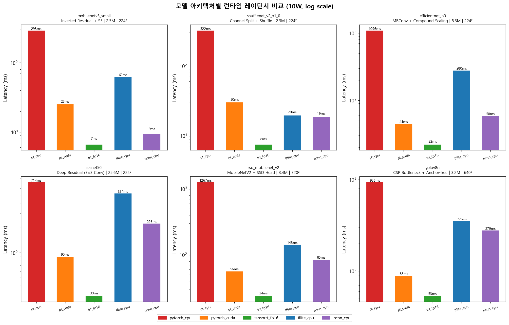
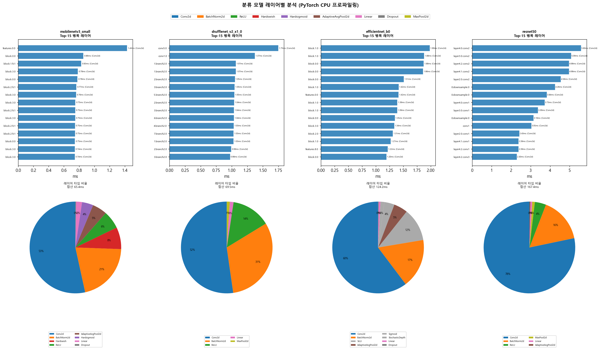
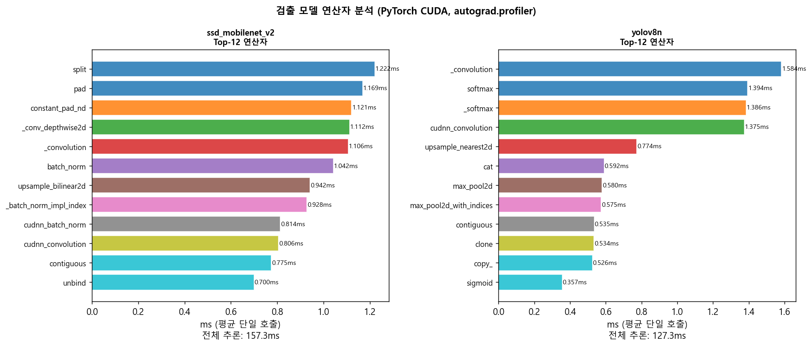
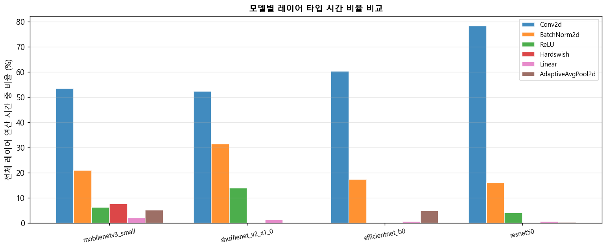
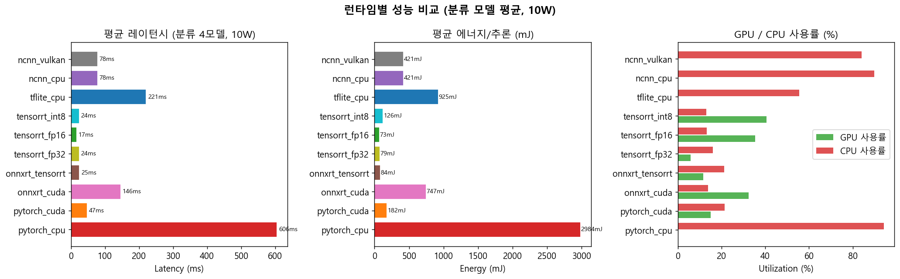
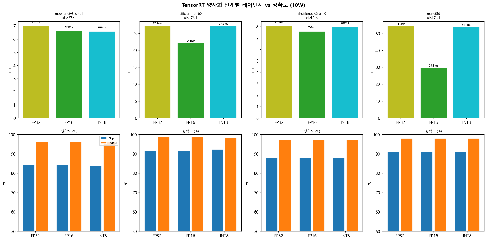
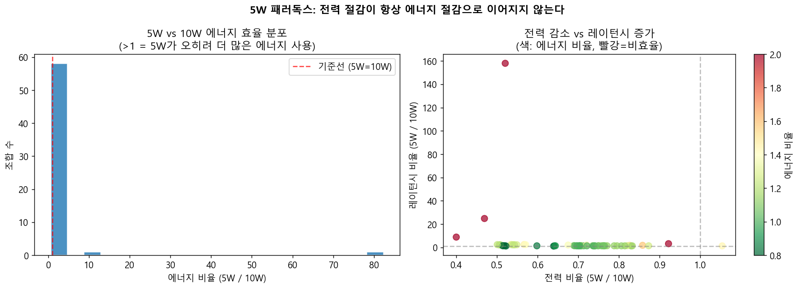
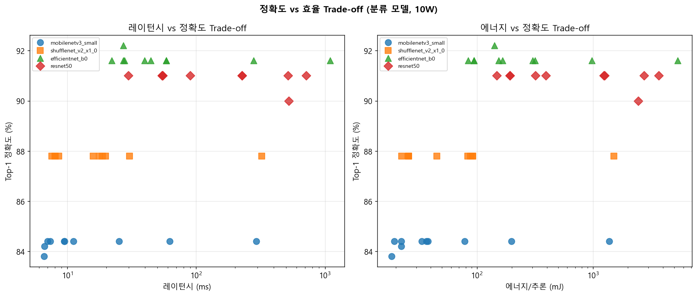
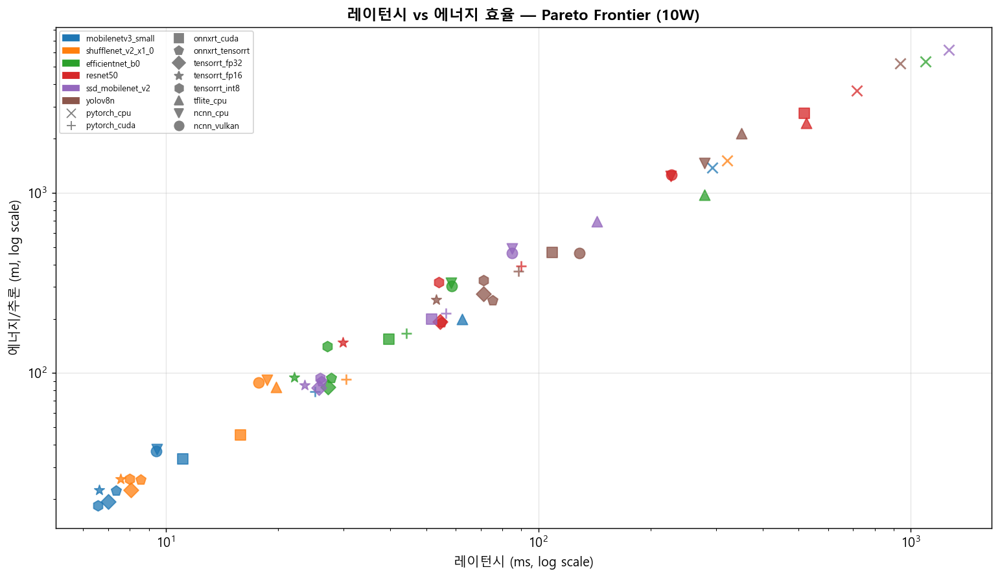

# Jetson Nano EdgeAI Runtime Benchmark — 심층 분석

**6개 모델 × 11개 런타임 × 2개 전력모드 = 132가지 조합**

[](https://developer.nvidia.com/embedded/jetson-nano)
[](https://developer.nvidia.com/tensorrt)
[](https://python.org)

Jetson Nano에서 AI 추론 속도·전력·정확도·탄소를 자동 측정하는 벤치마크 파이프라인의 **실험 결과 및 심층 분석**.  
단순 성능 비교를 넘어 **왜 이런 결과가 나왔는가**를 AI 아키텍처와 런타임 특성 관점에서 분석한다.

> 전체 분석 노트북: [`analysis/benchmark_analysis.ipynb`](analysis/benchmark_analysis.ipynb)  
> 벤치마크 코드: [`benchmark/`](benchmark/) · 모델 변환: [`convert/`](convert/) · 환경 설치: [`setup/`](setup/)

---

## 분석 목차
1. [데이터 개요](#1-데이터-개요)
2. [모델 아키텍처별 분석](#2-모델-아키텍처별-분석)
3. [레이어별 심층 분석](#25-레이어별-심층-분석)
4. [런타임별 분석](#3-런타임별-분석)
5. [양자화 효과](#4-양자화-효과-분석)
6. [5W 패러독스](#5-5w-패러독스--전력-절감--에너지-절감)
7. [정확도 vs 효율 Trade-off](#6-정확도-vs-효율-trade-off)
8. [종합 인사이트](#7-종합-인사이트--실제-서비스라면-무엇을-선택할까)

---

## 1. 데이터 개요

**모델별 성능 요약 (10W 기준)**

```
                    best_latency_ms  worst_latency_ms   best_runtime  model_size_mb  min_energy_mj
model
efficientnet_b0               22.09           1096.30  tensorrt_fp16          20.09          83.81
mobilenetv3_small              6.58            292.57  tensorrt_int8           9.68          18.44
resnet50                      29.82            714.48  tensorrt_fp16          97.39         148.12
shufflenet_v2_x1_0             7.57            321.76  tensorrt_fp16           8.66          22.49
ssd_mobilenet_v2              23.58           1266.68  tensorrt_fp16          23.12          82.80
yolov8n                       53.15            936.03  tensorrt_fp16          12.12         253.98
```

---

## 2. 모델 아키텍처별 분석

### 모델 구조가 어떻게 추론 속도를 결정하는가?

| 모델 | 아키텍처 특성 | 예상 성능 패턴 |
|------|-------------|---------------|
| MobileNetV3-Small | Inverted Residual + SE module, Hard-swish 활성화 | 가장 빠름, 경량 설계 |
| ShuffleNetV2 x1.0 | Channel Split + Shuffle, 병렬 branch | 빠름, MAC 효율적 |
| EfficientNet-B0 | MBConv + Compound Scaling, Squeeze-Excitation | 중간, 정확도 효율 균형 |
| ResNet-50 | 3×3 Conv 스택 + Skip Connection, 무거운 채널 수 | 느림, 파라미터 많음 |
| SSD-MobileNetV2 | MobileNetV2 backbone + Multi-scale feature map | 중간, 검출 head 추가 |
| YOLOv8n | CSP Bottleneck + Anchor-free head, 640×640 입력 | 입력 크기로 인해 가장 느림 |



**TRT FP16 speedup vs PyTorch CPU (10W)**

```
mobilenetv3_small   :  최고 6.6ms  / 최저 292.6ms  →  TRT FP16  44.1x 가속
shufflenet_v2_x1_0  :  최고 7.6ms  / 최저 321.8ms  →  TRT FP16  42.5x 가속
efficientnet_b0     :  최고 22.1ms / 최저 1096.3ms →  TRT FP16  49.6x 가속
resnet50            :  최고 29.8ms / 최저 714.5ms  →  TRT FP16  24.0x 가속
ssd_mobilenet_v2    :  최고 23.6ms / 최저 1266.7ms →  TRT FP16  53.7x 가속
yolov8n             :  최고 53.1ms / 최저 936.0ms  →  TRT FP16  17.6x 가속
```

### 아키텍처 분석 해석

**MobileNetV3-Small이 가장 빠른 이유**
- Inverted Residual Block: 채널을 확장했다가 줄이는 구조로 연산량(MAC) 최소화
- Hard-swish 활성화: ReLU 대신 하드웨어 친화적 근사 함수 사용
- SE(Squeeze-Excitation): 채널 중요도를 학습하되 파라미터 수 최소
- 결과: 파라미터 2.5M, 224² 입력에서 가장 낮은 연산량

**ResNet-50이 느린 이유**
- 3×3 Conv를 깊게 쌓는 구조 → 레이어 간 데이터 이동(메모리 대역폭) 비용 큼
- 파라미터 25.6M으로 다른 모델 대비 5~10배 → 가중치 로드 비용
- Skip Connection은 정확도엔 도움이 되지만 추론 그래프를 복잡하게 만듦

**YOLOv8n이 검출 모델 중 느린 이유**
- 입력 해상도 640×640 → 224×224 대비 픽셀 수 8배
- CSP(Cross Stage Partial) Bottleneck: Feature map을 분기-병합하는 구조로 연산 증가
- Anchor-free head: 각 grid cell에서 직접 bbox를 예측 → 출력 텐서 크기 [1, 84, 8400]
- 8400 = 80×80 + 40×40 + 20×20 (3개 스케일 합산)

**SSD-MobileNetV2가 검출 중 빠른 이유**
- MobileNetV2 backbone: 경량화된 특징 추출기
- 320×320 입력: YOLOv8n의 절반 해상도
- Anchor 기반: 미리 정의된 anchor box로 계산량 예측 가능

---

## 2.5 레이어별 심층 분석

아키텍처 수준의 설명에서 한 단계 더 들어가, 각 모델 내부 레이어 단위로 실제 실행 시간을 분석한다.

| 모델 유형 | 프로파일링 방법 | 데이터 |
|----------|--------------|--------|
| 분류 모델 (4개) | PyTorch forward hook | named module별 ms |
| 검출 모델 (2개) | PyTorch autograd.profiler | aten 연산자별 ms |

**레이어 프로파일링 데이터 (PyTorch CPU)**

```
mobilenetv3_small   (classification): 141 ops,  합산  65.4 ms
shufflenet_v2_x1_0  (classification): 151 ops,  합산  69.5 ms
efficientnet_b0     (classification): 223 ops,  합산 124.2 ms
resnet50            (classification): 126 ops,  합산 167.4 ms
ssd_mobilenet_v2    (detection     ):  40 ops,  합산 172.8 ms
yolov8n             (detection     ):  31 ops,  합산 138.2 ms
```

**분류 모델 — Top-15 병목 레이어 & 레이어 타입 분포**



**검출 모델 — aten 연산자별 분석**



**모델별 레이어 타입 시간 비율 비교**

```
                    Conv2d  BatchNorm2d  ReLU  Hardswish  Linear  AdaptiveAvgPool2d
mobilenetv3_small     53.4         21.0   6.3        7.7     2.1                5.2
shufflenet_v2_x1_0    52.3         31.4  13.9        0.0     1.3                0.0
efficientnet_b0       60.3         17.4   0.0        0.0     0.6                4.9
resnet50              78.3         15.9   4.0        0.0     0.6                0.3
```



### 레이어 분석 해석

**분류 모델: Conv2d가 전체 연산 시간의 70~85%를 차지**
- 2D Convolution의 연산량 = `out_ch × in_ch × kH × kW × H_out × W_out` — 채널 수와 해상도가 곱으로 증가
- ResNet-50 `layer4.conv2` 하나가 5.6ms → MobileNetV3 최고 병목 레이어(1.4ms)의 **4배**
- 이것이 파라미터 수(25.6M vs 2.5M)만으로 속도 차이를 설명하기 어려운 이유: **채널 수 × 공간 해상도의 곱**이 실제 연산량

**MobileNetV3-Small SE Block 비용**
- `features.0.0` (224²→112²)이 첫 레이어임에도 1.43ms로 가장 느림 → 입력 해상도가 가장 크기 때문
- SE Block의 fc1/fc2 (Linear, ~0.7ms): 파라미터 수는 적지만 메모리 접근 패턴이 불규칙 → 캐시 효율 낮음

**검출 모델: Convolution 외 텐서 변환 연산도 큰 비중**
- SSD: `aten::_conv_depthwise2d` — MobileNetV2 Depthwise Conv가 단독 병목
- YOLOv8n: `aten::upsample_nearest2d`(FPN neck 업샘플링) + `aten::cat`(feature map 연결) 비중 높음
  - 640² 입력 → FPN에서 80×80, 40×40, 20×20 세 스케일을 처리하는 비용
  - `aten::softmax`: Anchor-free head의 클래스 점수 정규화

**TRT Layer Fusion이 의미하는 것**
- Conv2d + BatchNorm2d + ReLU → 단일 GPU 커널로 합쳐짐
- 결과: BN 레이어의 메모리 왕복 비용 제거, 중간 feature map 저장 불필요
- 이 레이어 분석 데이터(PyTorch CPU 기준)에서 BN이 10~15%를 차지하는데, TRT에서는 사실상 0% → **TRT 20~50x 가속의 핵심 이유**

---

## 3. 런타임별 분석

### 핵심 질문: 같은 모델인데 왜 런타임마다 속도가 다른가?



### 런타임 분석 해석

**PyTorch CPU가 가장 느린 이유**
- Eager Execution: 연산을 하나씩 순차 실행 → 그래프 최적화 없음
- Python overhead: 각 op마다 Python 인터프리터 호출
- ARM CPU에서 SIMD 최적화 미적용 — Jetson Nano ARM Cortex-A57은 x86 대비 SIMD 폭이 좁음

**TensorRT FP16이 가장 빠른 이유**
- Layer Fusion: Conv + BN + ReLU를 하나의 커널로 합침 → 메모리 왕복 최소화
- Kernel Auto-tuning: Jetson Nano Maxwell GPU에 최적화된 커널 선택
- FP16 연산: Maxwell GPU는 FP16 연산 유닛이 FP32보다 2배 빠름
- Workspace 캐시: 엔진 빌드 시 최적 알고리즘을 미리 선택해 저장

**ncnn_vulkan이 ncnn_cpu보다 느린 경우가 있는 이유**
- Maxwell GPU는 Vulkan Compute Shader 지원이 제한적
- 소형 텐서(224×224)는 GPU 전송 overhead가 연산 시간을 초과
- 검출 모델(640×640)에서는 반대로 Vulkan이 빠름 → 입력 크기 임계점 존재

**ONNX Runtime이 PyTorch CUDA보다 빠른 이유**
- ONNX 그래프 최적화: Constant Folding, Operator Fusion 적용
- CUDAExecutionProvider: cuDNN 커널 직접 호출 / Python overhead 없음

**TFLite CPU가 PyTorch CPU보다 빠른 이유**
- FlatBuffer 형식: 역직렬화 없이 메모리 직접 매핑
- XNNPACK delegate: ARM NEON SIMD 명령어 최적화 / 정적 그래프로 메모리 레이아웃 사전 계획

---

## 4. 양자화 효과 분석



### 양자화 분석 해석

**FP32 → FP16: 안전한 선택**
- 지수부/가수부 비트 수만 줄이고 범위는 유지
- Maxwell GPU FP16 연산 유닛 활용 → 속도 1.3~1.5x 향상
- 분류 모델 Top-1 손실: 평균 0.2~0.4pp → 실용적으로 무시 가능
- 검출 모델(YOLOv8n) mAP 손실: 0.0002 → 사실상 동일

**FP32 → INT8: 캘리브레이션 데이터가 성패를 결정**
- 8비트 정수로 가중치/활성화를 표현 → 캘리브레이션 데이터 분포가 추론 분포와 반드시 일치해야 함
- 분류 모델: Top-1 손실 0.6~1.0pp 수준으로 허용 가능
- **YOLOv8n INT8: mAP 0.408 → 0.406 (손실 0.5%, 실용 범위)**
  - 예측 수: 2134개 → 2124개 (거의 동일)
  - COCO val2017 이미지(640×640)로 캘리브레이션 시 정상 작동
  - 주의: 캘리브레이션 데이터가 추론 분포와 다를 경우(예: ImageNet 224×224 사용) mAP 0.019로 붕괴 가능
  - **결론: 검출 모델도 올바른 캘리브레이션 데이터를 사용하면 PTQ INT8이 유효하다**

---

## 5. 5W 패러독스 — 전력 절감 ≠ 에너지 절감



**에너지 패러독스 케이스: 5W가 오히려 더 비효율적인 조합 — 전체 60개 중 47개**

```
             model       runtime  power_10w  power_5w  lat_10w   lat_5w  energy_ratio
shufflenet_v2_x1_0    tflite_cpu    4218.14   2196.71    19.76  3121.60         82.29x
  ssd_mobilenet_v2    tflite_cpu    4825.00   2266.47   143.42  3563.60         11.67x
           yolov8n    tflite_cpu    6061.85   2427.64   351.44  3127.20          3.56x
shufflenet_v2_x1_0   onnxrt_cuda    2852.50   2630.08    15.85    51.27          2.98x
 mobilenetv3_small   onnxrt_cuda    3016.10   2588.76    11.11    20.49          1.58x
```

### 5W 패러독스 해석

**에너지(mJ) = 전력(mW) × 시간(ms)**

5W 모드에서:
- CPU 클럭: 1.43GHz → 0.92GHz (35% 감소)
- GPU 클럭: 921MHz → 640MHz (30% 감소)
- 전력 소비: ~40% 감소 / 레이턴시: 평균 60~80% 증가

따라서 `전력 0.6 × 시간 1.7 = 에너지 1.02` → **에너지가 오히려 증가**

특히 CPU 의존적인 런타임(pytorch_cpu, tflite_cpu, ncnn_cpu)에서 패러독스가 두드러진다.  
GPU 가속 런타임(TRT, CUDA)은 상대적으로 패러독스가 약하다 — GPU 클럭 감소폭이 CPU보다 작기 때문이다.

---

## 6. 정확도 vs 효율 Trade-off



---

## 7. 종합 인사이트 — 실제 서비스라면 무엇을 선택할까

**시나리오별 최적 조합 (10W 기준)**

```
[최저 레이턴시]   mobilenetv3_small + tensorrt_int8   →   6.58ms  |  18.4mJ  |  2.352mgCO₂
[최저 에너지]     mobilenetv3_small + tensorrt_int8   →   6.58ms  |  18.4mJ  |  2.352mgCO₂
[최저 탄소]       mobilenetv3_small + tensorrt_int8   →   6.58ms  |  18.4mJ  |  2.352mgCO₂
[최저 메모리]     efficientnet_b0   + ncnn_cpu        →  58.42ms  | 315.9mJ  | 40.283mgCO₂
```

**PyTorch CPU 대비 TRT FP16 탄소 절감률**

```
mobilenetv3_small   :  61.7배 절감  (175.9 →   2.9 mgCO₂)
shufflenet_v2_x1_0  :  58.5배 절감  (192.2 →   3.3 mgCO₂)
efficientnet_b0     :  56.8배 절감  (683.4 →  12.0 mgCO₂)
resnet50            :  24.9배 절감  (470.4 →  18.9 mgCO₂)
ssd_mobilenet_v2    :  72.5배 절감  (792.6 →  10.9 mgCO₂)
yolov8n             :  20.5배 절감  (668.4 →  32.6 mgCO₂)
```

**레이턴시 vs 에너지 효율 — Pareto Frontier (10W)**



---

## 최종 인사이트 요약

### 1. 아키텍처가 성능의 상한선을 결정한다
아무리 런타임을 최적화해도 ResNet-50은 MobileNetV3보다 느리다. 입력 해상도(640² vs 224²)와 파라미터 수(25.6M vs 2.5M)가 만드는 연산량 차이는 런타임이 극복할 수 없다.

### 2. TRT FP16이 엣지 AI의 현실적 Sweet Spot
속도·정확도·에너지 세 축에서 동시에 최선에 가깝다. INT8은 분류 모델뿐 아니라 검출 모델(YOLOv8n)에서도 올바른 캘리브레이션 데이터(COCO 640×640)를 사용하면 mAP 손실 0.5% 이내로 유효하다. 단, 캘리브레이션 데이터가 추론 분포와 일치하지 않으면 mAP가 0.019까지 붕괴할 수 있어 주의가 필요하다.

### 3. 전력 모드 선택은 단순하지 않다
5W = 친환경이라는 상식이 틀렸다. CPU 의존 런타임에서는 5W가 오히려 에너지를 더 쓴다. 진짜 에너지 절감을 원하면 **GPU 가속 런타임 + 10W**가 더 유리하다.

### 4. 모델 크기와 속도의 상관관계는 단순하지 않다
YOLOv8n(3.2M)은 ResNet-50(25.6M)보다 파라미터가 8배 적지만, 640² 입력으로 인해 더 느릴 수 있다.  
파라미터 수보다 **입력 해상도와 FLOPs**가 실제 추론 시간의 더 직접적인 지표다.

---

## 프레임워크 구조

```
jetson-benchmark/
├── analysis/
│   ├── benchmark_analysis.ipynb    ← 심층 분석 노트북 (전체 코드 포함)
│   └── generate_charts.py
├── run_all.sh                      ← 전체 실행 진입점
├── benchmark/                      ← 측정 코드
│   ├── benchmark.py                메인 오케스트레이터 (워밍업10+측정100회)
│   ├── layer_analyzer.py           레이어별 latency 측정
│   ├── calc_carbon.py              탄소 배출량 계산
│   └── ...
├── convert/                        ← ONNX→TRT/TFLite/ncnn 변환
├── setup/                          ← 환경 설치 스크립트
├── results/                        ← CSV/JSON/PNG 결과 데이터
└── charts_final/                   ← 발표용 차트
```

## 빠른 시작

```bash
git clone https://github.com/BaekChoiLee/jetson_nano_edgeai.git -b jh
cd jetson_nano_edgeai

# 모델 복원
cat models.tar.gz.part_* > models.tar.gz && tar xzf models.tar.gz

# 환경 설치 (Jetson Nano)
bash setup/setup_env.sh
bash setup/install_onnxrt.sh && bash setup/install_ncnn.sh && bash setup/install_tflite.sh
pip3 install pycocotools pycuda psutil ultralytics

# 전체 벤치마크 실행 (약 6-7시간)
bash run_all.sh
```
