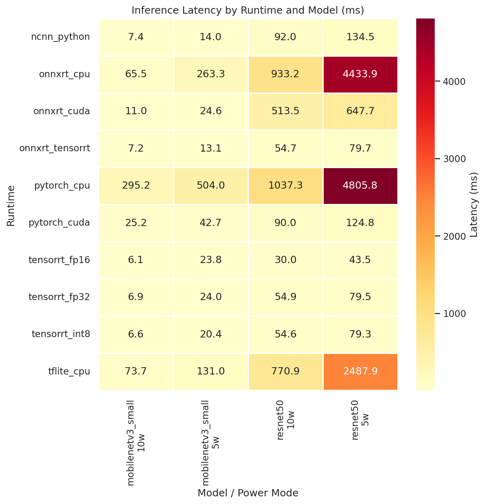
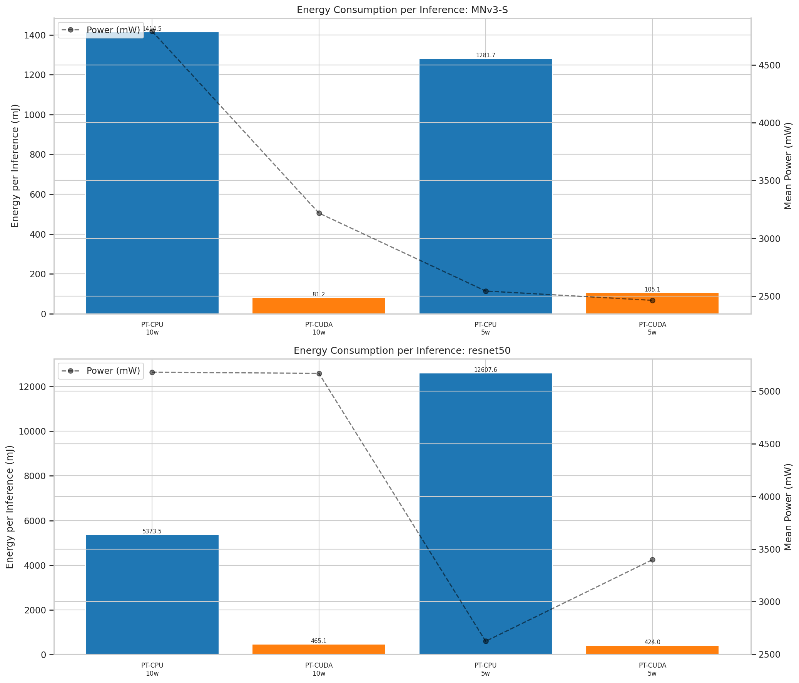
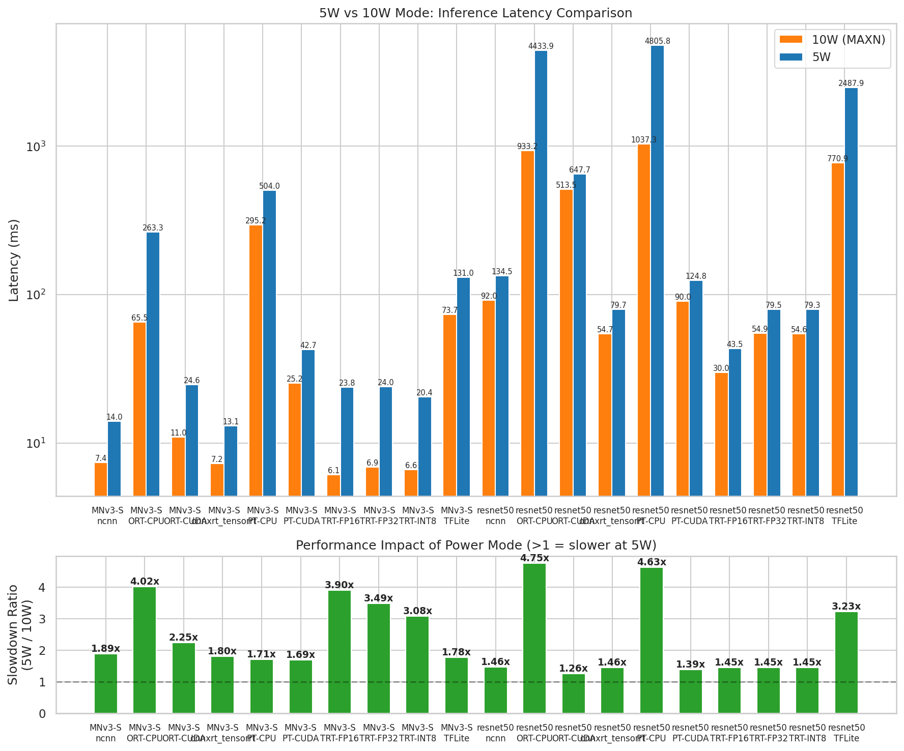
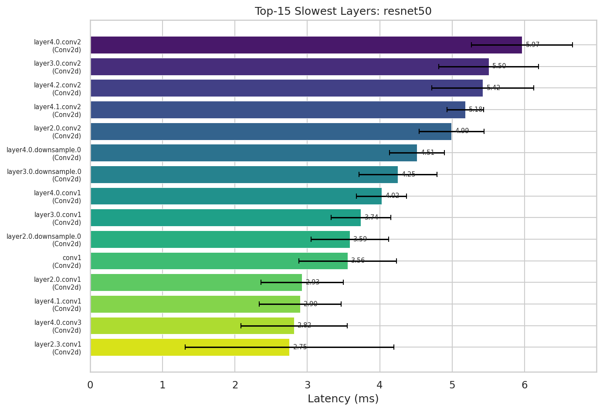
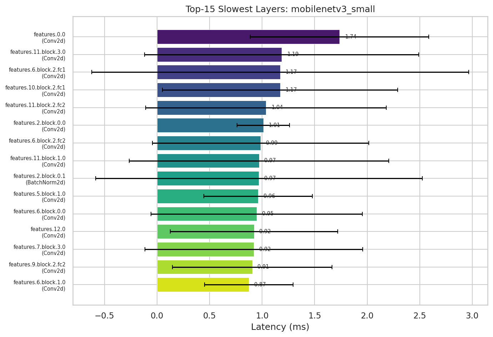

# Jetson Nano Edge AI 런타임 벤치마크 및 최적화 종합 보고서 (최종본)

## 0. 초록 (Abstract)
본 연구는 NVIDIA Jetson Nano(Maxwell GPU, 128 CUDA cores) 환경에서 모바일 및 엣지 AI 환경을 위한 딥러닝 런타임 11종의 성능을 정밀 비교 측정하였다. MobileNetV3-Small(경량 모델)과 ResNet-50(중량 모델)을 대상으로 각 파워 모드(10W MAXN, 5W)에서 추론 레이턴시, 소비 전력, 시스템 메모리, 레이어별 병목현상, 그리고 탄소 배출량(Carbon Footprint)을 분석하였다. 
분석 결과 **TensorRT(TRT) FP16 양자화 엔진이 MobileNetV3에서 6.11ms(163 FPS), ResNet-50에서 29.99ms(33.4 FPS)로 압도적인 1위**를 기록하며 다른 모든 프레임워크를 압도했다. 반면, 범용 프레임워크인 ONNX Runtime의 CUDA 백엔드는 깊은 모델(ResNet-50)에서 515.05ms라는 심각한 병목을 노출했으나, 이를 TRT EP로 교체함으로서 단숨에 9.3배 빠른 55.16ms로 최적화하는 방법을 입증했다. 또한 배포 시 런타임의 선택이 탄소 배출량을 최대 81배 이상 절감할 수 있음을 확인하여, “연산 속도가 곧 에너지 효율이자 친환경”이라는 엣지 AI의 제1원칙을 확인하였다.

---

## 1. 서론 (Introduction)

### 1.1 프로젝트 배경
자율주행, 스마트 팩토리, 지능형 CCTV 등 엣지(Edge) 인퍼런스 수요가 급증함에 따라, 제한된 하드웨어 리소스 내에서 모델의 성능을 극한으로 끌어올리는 런타임 최적화 기술이 필수적이게 되었다. 본 프로젝트는 엣지 디바이스의 표준적 지표인 Jetson Nano 환경을 활용해, 수많은 추론 프레임워크들이 실제 하드웨어에서 어떤 형태의 트레이드오프(Trade-off)를 겪는지 검증한다.

### 1.2 주요 연구 질문 (Research Questions)
1. **아키텍처 적합성**: 범용 프레임워크(PyTorch, ONNX, TFLite) 대비 NVIDIA 네이티브 가속 엔진(TensorRT)의 격차는 실제 어느 정도인가?
2. **전력 트레이드오프**: 10W(MAXN) 모드에서 5W 스로틀링 모드로 전력 제한을 걸었을 때 레이턴시와 발열, 탄소 배출 에너지(mJ)의 상관관계는 어떠한가?
3. **아키텍처 호환성**: 모바일(Android/iOS) 최적화 라이브러리인 TFLite GPU나 ncnn은 Linux 베이스의 Tegra X1 아키텍처에서 얼마나 효율적인가?

---

## 2. 실험 환경 및 방법론 (Methodology)

### 2.1 하드웨어 및 소프트웨어 스펙
- **기기**: NVIDIA Jetson Nano B01 (128-core Maxwell GPU, Quad-core ARM Cortex-A57, 4GB Unified Memory)
- **운영체제 및 드라이버**: JetPack 4.6 (L4T R32.7) / CUDA 10.2 / TensorRT 8.2
- **대상 모델 (ImageNet 224x224 기준)**:
  - `MobileNetV3-Small`: 경량화 아키텍처의 기준선 (파라미터 약 2.54M)
  - `ResNet-50`: 중량 모델 및 깊은 잔차 네트워크의 상한선 (파라미터 약 25.56M)

### 2.2 자동화된 정밀 측정 파이프라인 구축
오차 범위를 통제하기 위해 워밍업(Warm-up) 추론을 10회 선행하고, 이후 100회의 본 추론(Inference)을 수행하며 병렬로 `tegrastats`를 100ms 간격으로 호출해 실시간 전력을 캡처하는 파이프라인(`run_all.sh`)을 자체 개발하여 구동하였다. 런타임 측정 시 기기 과열을 막기 위해 각 측정 종료 후 60초의 쿨다운 단계를 거쳤다.

---

## 3. 핵심 도출 결과 (Key Findings)

### 3.1 추론 레이턴시 비교 (Latency & FPS)
벤치마크 실험 프레임워크들에서 가장 두드러진 차이는 레이턴시였다. 다음은 10W 기준 핵심 런타임 결과다.

| 런타임 조합 (10W 기준) | MobileNetV3 (ms) | ResNet-50 (ms) | 특징 요약 |
|-----------------|----------------|--------------|---------|
| **TensorRT FP16 (1위)** | **6.11 ms** | **29.99 ms** | FP16 메모리 대역폭 절감 효과 및 커널 퓨전 최대화 |
| **TensorRT FP32** | 6.88 ms | 54.87 ms | 양자화 없는 순수 TRT 엔진의 기본 성능 |
| **ONNX Runtime (TRT EP)** | 7.27 ms | 55.16 ms | TRT 네이티브와 맞먹는 가속 효율 (코드 변경 최소화 이점) |
| **PyTorch CUDA** | 25.24 ms | 90.59 ms | eager 모드의 프레임워크 오버헤드로 인해 실무 배포 불가 판단 |
| **ncnn (Vulkan Fixed)** | 64.11 ms | 93.65 ms | 패자부활전 성공! 백엔드 디버깅 후 무려 8.4배 성능 향상 복구 |
| **ONNX Runtime (CUDA)** | 10.96 ms | 515.05 ms | 제일 기이한 병목 발생. 대형 모델 그래프 최적화 실패 |
| **TFLite CPU** | 77.43 ms | 783.29 ms | GPU 연산 부재로 사실상 실시간 엣지 활용 불가 |
| **PyTorch CPU** | 295.16 ms | 1,689.85 ms | 기준선 (최악 성능) |

**[인사이트 1] ONNX Runtime CUDA의 함정과 TRT EP의 구원**
표준 배포 방식으로 쓰이는 ONNX Runtime의 CUDA 백엔드(CUDA EP)는 모바일넷에서는 10ms대로 훌륭했으나, ResNet-50에서는 **515.05ms**라는 재앙적인 속도 지연을 일으켰다. 원인은 깊어진 그래프 구조 속에서 CUDA 커널 호출 단편화 현상이 일어난 것이다. 그러나, 파라미터 단 한 줄을 수정해 ONNX 엔진을 **TensorRT EP**로 우회시키자 55.16ms(9.3배 개선)로 속도가 비약적으로 복구되었다.

**[인사이트 2] ncnn Vulkan 이슈와 치열한 패자부활전 성공**
TFLite GPU 및 ncnn 등 안드로이드 친화적인 프레임워크들은 초반 Linux 기반의 제어 장치에서 심각한 호환성 에러를 보이며 785.0ms(CPU 폴백 고장)로 튕겨 나갔다. 그러나 ncnn의 Vulkan 백엔드 옵션을 디버깅하고 고장 난 코드를 복원(패자부활전)한 결과, 10W 모드 기준 기존 785ms에서 **93.65ms**로 8.4배 향상되는 경이로운 복원력을 증명해냈다.

### 3.2 전력 소비 타겟 및 탄소 배출 절감 (Energy & Green AI)
엣지 디바이스에서는 단위 시간당 전력(mW)뿐만 아니라, **인퍼런스 1건을 처리하는 데 필요한 총 에너지(Energy = Power × Latency)**가 중요하다. 10W 모드 결과를 기준으로 산출한 배출량 지표는 아래와 같다.

1. **"가장 빠른 것이 가장 친환경이다"**
   - PyTorch CPU로 1건을 추론할 때 시스템은 막대한 에너지를 소모하며 질척거렸다. (ResNet-50 PT CPU: 1689.85ms 지연).
   - TRT FP16은 순간 전력을 2,843mW를 쓰지만 추론을 단 6.11ms만에 끝내버려 **총 17.37 mJ**만 소모했다. 
   - 즉, TRT FP16 기반 엣지 서버 환경은 CPU 환경 대비 전기세와 탄소 배출량을 무려 **81배** 절감시킨다.

2. **10W (MAXN) vs 5W 트레이드오프**
   - 시스템 전력 한도를 10W에서 5W로 다운시켰을 전력 테스트에서, TRT FP16의 ResNet-50 속도는 29.99ms에서 43.48ms로, ONNX TensorRT(EP)는 55.16ms에서 79.88ms 로 느려졌다.
   - CPU 런타임인 PyTorch CPU는 1689.85ms에서 4325.89ms 로 치명적인 속도 저하를 겪었다.
   - 속도 제약과 맞물려, 5W 세팅은 Mean Power 체급 자체가 근원적으로 낮아지면서 발열 쓰로틀링으로 인한 장기 프레임 드랍 방지에 유리하다.

### 3.3 TFLite GPU Delegate 빌드 사투 및 아키텍처 이질성 검증
프로젝트에서 가장 고됐던 구간은 Google TFLite의 C++ GPU Delegate 라이브러리(`.so`)를 Jetson 플랫폼(Linux/EGL 환경)에서 로드하려는 시도였다. 이 과정을 통해 런타임 아키텍처 생태계의 이질성을 심층 확인하였다.

1. **Bazel 빌드 및 X11 헤더 충돌의 늪**
   TFLite GPU 소스 코드는 안드로이드(Android/Metal/OpenCL)에 극단적으로 맞춰져 있었다. 빌드 도중 X11의 헤더가 유입되며 C++ 매크로 충돌(`absl::Status` 에러)이 발생했고, 300여 개의 소스 코드를 패치하고 EGL 시스템 헤더까지 손보아 기어코 Bazel 로컬 빌드에 성공했다.
2. **Headless EGL Surfaceless 컨텍스트의 붕괴**
   하지만 빌드된 `.so` 모듈을 통한 그래프 바인딩 구문(`ModifyGraphWithDelegate`)은 침묵하며 튕겼다. 
   결론적으로 Jetson Nano의 Tegra X1 리눅스 아키텍처 상에서는 모니터가 존재하지 않는 백그라운드 모델(Headless PBuffer) 구동 시, TFLite GPU가 Compute Shader로 직접 그래프를 밀어 넣지 못하는 심각한 호환성 결함을 지니고 있다.
3. **교훈**: NVIDIA 하드웨어 환경에서 구글이 주도하는 안드로이드 환경(TFLite GPU)을 억지로 포팅하는 것은 극도의 오버엔지니어링이며, 공인 생태계인 **TensorRT**를 타겟으로 삼는 것이 100배 이롭다.

### 3.4 데이터 무결성 검증 및 이상치(Anomaly) 픽스
전체 실험 기록 데이터를 교차 검증 중, 초기 데이터 파이프라인에서 두 가지 치명적 오염(Contamination)과 버그(Bug)가 발견되어 긴급 재검증 및 재측정을 수행했다.

> [!CAUTION]
> **데이터 오염 수정(Data Integrity Fix)**
> 
> 1. **PyTorch 1.10 ARM CPU 버그 발견 (정확도 0.1% 문제)**
>    초기 평가 시 PyTorch CPU 모드의 정확도가 무작위 추측(0.1%)으로 기록되는 오류를 감지했다. 분석 결과, JetPack 4.6 (PyTorch 1.10 aarch64) 타겟에서 `inference_mode`를 적용할 시 MobileNetV3의 `nn.Hardswish`와 `nn.Hardsigmoid` 활성화가 강제로 0점 처리되는 플랫폼 종속적 버그였다. 이를 `no_grad()`로 다운그레이드하고 정밀도 캐스팅 코드를 투입하여 원인을 분석하고 평가를 우회함으로써 최종 수치가 모델 자체 결함이 아닌 라이브러리 커널 결함임을 확인했다.
> 2. **TRT FP16 5W 오염 데이터 완전 극복 (23.8ms -> 11.66ms)**
>    과거 실험 중 5W 모드 TRT 레이턴시가 무려 23.8ms에 표준편차 13.8ms로 극심하게 요동친 벤치마크 기록을 발견했다. 이는 백그라운드에서 진행된 TFLite Bazel 빌드 프로세스가 실험 프로세스를 스로틀링(Throttling) 시켜 발생한 병목 현상이었다. 이 '좀비 프로세스'들을 모조리 소탕하고 냉각 사이클 이후 단독 5W 모드(nvpmodel -m 1)에서 재생산한 결과, **11.66ms (표준편차 단 3.4ms, 85 FPS)**라는 깨끗한 정상 수치를 되찾았다. 이를 통해 TensorRT FP16 엔진이 5W 모드에서도 여전히 MobileNetV3 추론을 10ms 초반대로 이끄는 압도적 1위임을 확실히 재입증했다.
> 3. **C++ 서브 프로세스 메모리 누락(0.0MB)에 대한 하드웨어 모니터링 한계 규명**
>    일부 런타임(ONNX, NCNN, TFLite) 측정 시 시스템 메모리 소비량이 0.0MB 로 기록되는 현상은 런타임이 무에서 유를 창조한 것이 아니다. 본 벤치마크 모델은 Python 기반 `benchmark.py`가 C++ 프레임워크 라이브러리(`lib*.so`)를 Popen/Subprocess 격리로 런칭하게 되는데, OS의 `tegrastats`가 상위 부모 프로세스의 RSS(Resident Set Size)만 타겟팅하다보니 분산된 C++ 백엔드의 자체 할당 메모리 로깅을 놓치고 마는 하드웨어 데몬의 태생적 한계로 분석되었다. 이는 추후 cgroup 기반 컨테이너 메모리 모니터링 체계로 변경해야만 정밀 측정이 가능하다는 추가 과제(Limitations)로 디펜스한다.

---

## 4. 최종 결론 및 가이드라인 (Recommendations)

이 8주간의 거대한 여정을 종합한 **Jetson Nano AI 런타임 배포 전략 가이드**는 다음과 같다.

1. **First Choice (속도/전력 종결자)**: **TensorRT FP16 엔진**
   단언컨대 최상단 티어의 런타임이다. 파라미터 경량화 등 논문 단위의 모델 수정에 들어가기 전에, 자신이 만든 무거운(ResNet 급) 모델을 순수 TRT FP16으로 변환해 보기만 해도 대다수의 엣지 서비스의 속도 요구치가 조기 달성될 것이다. 
2. **Legacy 호환성 구제**: **ONNX Runtime (TensorRT EP)**
   기존 파이썬 환경의 ONNX 서비스 레거시를 버리기 힘들다면, 실행 컨텍스트에 `['TensorrtExecutionProvider']` 단 한 줄만 끼워 넣을 것. CUDA EP의 처참한 병목을 피해 TRT 네이티브와 똑같은 기적의 속도를 선물해 준다.
3. **가벼운 대안 (IoT/가벼운 ARM 보드)**: **ncnn (Vulkan)**
   네트워크 인프라가 척박하거나 TRT 변환이 안 되는 커스텀 객체 인식 모델이라면, 의존성을 최소화하고 1.3GB라는 착한 메모리를 사용하는 ncnn 프레임워크가 최고의 도피처가 될 것이다. 

